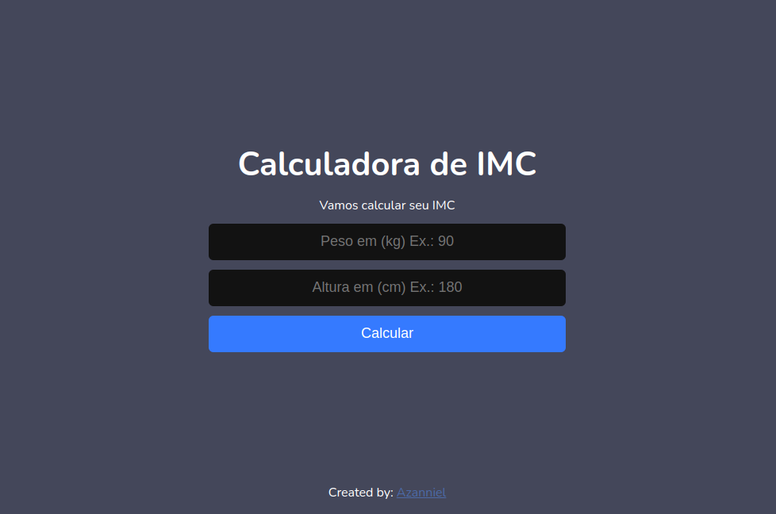

<p align="center">
  
</p>

<h2 align="center">
Calculadora de IMC
</h2>

<br>

<p align="center">
  
</p>

## 🧪 Tecnologias

Esse projeto foi desenvolvido com as seguintes tecnologias:

- [React](https://reactjs.org)
- [Vite](https://vitejs.dev/)

## 🚀 Como executar

Clone o projeto e acesse a pasta do mesmo.

```bash
$ git clone https://github.com/Azanniel/imc-project.git
$ cd imc-project
```

Para iniciá-lo, siga os passos abaixo:
```bash
# Instalar as dependências
$ yarn
# Iniciar o projeto
$ yarn dev
```

## 💻 Projeto

Calculadora IMC é um projeto simples para fixar os conhecimentos básicos de ReactJS e ainda aprender um pouco mais sobre a tecnologia. 

Este é um projeto desenvolvido durante a **[Semana React JS](https://www.youtube.com/watch?v=K-8YYSEYaB8&ab_channel=Sujeitoprogramador)**, iniciada no dia 31 de janeiro de 2021.

---

Rumo ao próximo nível 🚀 by Azanniel 👋🏻